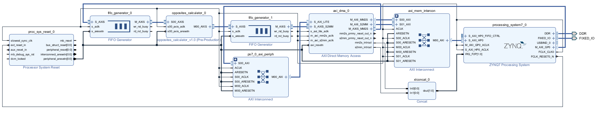
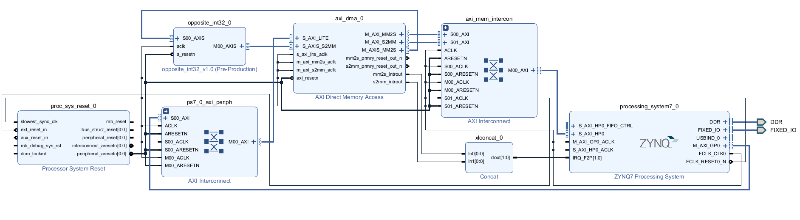

# Example DMA project for Zynq-7000 

This project is a reference as to how to configure a Zynq-7000 SoC to offload a datastream via DMA from the Processing System (PS) to a cusotm designed IP block on the Programmable Logic (PL), using interrupts. Similar project can be created in polling mode, following the guidance I provide in [another repository of mine](https://github.com/YannosK/DMA_Loopback_on_Zynq-7000). The custom IP block is created with the Vivado IP Packager ("Create and Package new IP" option) and will be written in Verilog. In this example application it will just be a block that receives an incoming stream of data via an AXI Stream Slave interface, compute their opposite values (the data will be interpreted as signed integers of 32 bit) and send them back to the DMA via an AXI Stream Master interface. The PS will run baremetal system applications, developed in C in the Vitis IDE.

This project was developed on a Windows 11 machine with Vivado and Vitis of version 22.2. The SoC used is the Digilent [Cora Z7S](https://digilent.com/reference/programmable-logic/cora-z7/start?srsltid=AfmBOop1WbKCwSRevTnR1wBTyK89O_web_5MYcPAdbv43u49Iq8fW7U7) FPGA development board.

I decided to have a kind of a guide of the steps I took in the [`README`](./README.md) of this repository, so that the viewers can recreate a similar project in their needs. This repository also contains the vivdao project that generated the hardware description files and the Vitis workspace with the software used. I decided not to leave the entire xilinx software support libraries out of this repository (even if they make it very large) so that the viewers of the repository can test that if they follow the steps I describe in the sections below then similar project structures will emerge.

## VIVADO side

### Vivado IP integrator - Block Design

1. insert a Zynq PS
  - from the schematic it has in the "Zynq Block Design" know that you neeed the following AXI interfaces:
    - a 32b AXI Master Port (usually the first one is `M_AXI_GP0`) which will connect and control the DMA via AXI interconnect
    - a high performance AXI Slave interface that as you see connects to the DDR memory controler (usually first one is `S_AXI_HP0`)
  - after you tick these boxes the changes will be reflected in the "PS-PL Configuration" section.
  - go to Interrupts
  - enable fabric interrupts
  - in the drop down menu in the hierarchy and in the PL-PS Interrupt ports tick the IRQ_F2P (FPGA to Processing System)
  - **do not run connection automation yet but you have to run board automation**
2. add a processing system reset
3. add an AXI DMA (the simple one)
  - the data width is an important parameter but _it does not directly reflect the data you will use in your software application_. I will leave it in 32 bits here (4 bytes), which exactly matches the word width of the software I will later write for the PS.
  - make sure you have the same data width on the read and write channels
  - if you intent on having continuous data in memory you can disable scatter gather engine
  - careful with the buffer length because I had problems later with vitis - the number of valid bits it says, when raised as an exponent of two, must produce a number larger to the length of the buffer you want to transfer from the PS. _It is best to just leave it at 14_.
  - in the end all I did in the current vivado version (22.2) was to simply disable the scatter gather engine and leave everything else as is
4. run connection automation and block automation. This will most likely insert an AXI interconnect that you had not inserted. Beware the following:
  - the AXI Master interface in the Zynq must go throught an AXI _peripheral_ interconnect and connect to the DMA `S_AXI_LITE` port. This is the interface from which the PS has access and configures the DMA controller
  - the DMA controler master control ports, which are `M_AXI_MM2S` and `M_AXI_S2MM` must got through an AXI _memory_ interconnect and connect to the high performance AXI slave interface in the Zynq system. This interface is what makes the PS and the DMA controller talk to the DDR memory controler. If you had scatter gather then it should have its own master port in the DMA peripheral and be connected in a similar fashion.
5. the DMA engine generated two interrupt signals so we need to use a concat block
  - add a concat block
  - connect its output to the `IRQ_F2P` in the PS
  - connect its two inputs to the `mm2s_introut` and `s2mm_introut` in the DMA block.
6. add a two FIFO generators with the following settings. **WARNING**: *this step could be skipped if you have FIFOs integrated inside your block design. Mine has not so I will add FIFOs here.*
  - make it AXI Stream and use common clock
  - `TDATA NUM BYTES` must be 4 bytes for 32 bit data
  - You want no `TUSER` so add 0 to `TUSER WIDTH`
  - Add `TLAST`
  - Connect the reset and the clock
  - the example will be simple so you could make the FIFO depth very shallow (I made it 64 in the "Config" section)
7. Connect the FIFOs to the DMA 
  - Connect the SLAVE interface `S_AXIS` of the FIFO 0 to  `M_AXIS_MM2S` interface on the DMA block.
  - Connect the master `M_AXIS` interface of the FIFO 1 to the `S_AXIS_S2MM` in the DMA
8. make your own IP - [_see section below_](#your-own-ip) - or insert the IP you will send data with DMA. In the simplest case it will have a slave and a master streaming interface
  - either drag and drop local file or insert it with the menu in block design like all the above
  - Connect the SLAVE interface `S_AXIS` of the IP to `M_AXIS` interface on the FIFO 0.
  - Connect the master `M_AXIS` interface to IP to the `S_AXIS` in the FIFO 1.
  - connect the clocks to the clock line and the resets to the reset line. **WARNING**: *AXI reset is **active low**. Have that in mind as you design your ip*
9. make sure you have connected all the clocks to the clock line and all the resets to the reset line
10. Run validation (checkbox)
11. In the address editor there are some DMA addresses but nothing you cannot do on Vitis
12. create the HDL wrapper and generate bitstream
13. export hardware as .xsa file (include bitstream)

_This design produced various version .xsa files:_
- _[DMA_Example_v1.xsa](./designs/vivado_2022.2/DMA_Example/DMA_Example_v1.xsa) creates problems in vitis - unable to have a transfer. I had forgoten a USER port in the FIFO interfaces and also too shallow FIFO depth._
- _[DMA_Example_v2.xsa](./designs/vivado_2022.2/DMA_Example/DMA_Example_v2.xsa) creates problems in vitis - unable to have a transfer. It has a depth in FIFOs of 1024 and only the needed ports in the FIFOs._
- _[DMA_Example_v3.xsa](./designs/vivado_2022.2/DMA_Example/DMA_Example_v3.xsa) works fine_
- _[DMA_Example_v4.xsa](./designs/vivado_2022.2/DMA_Example/DMA_Example_v4.xsa) is a debug version where the IP was left out leaving in only a FIFO (like a loopback example) and I added an ILA to see that everything is ok._
- _[DMA_Example_v5.xsa](./designs/vivado_2022.2/DMA_Example/DMA_Example_v3.xsa) works fine too, but I got rid of the FIFOs and it only has my IP._

After various tests of all of the process I describe in this guide I ended up with two working designs.

The first one stems from the [DMA_Example_v3.xsa](./designs/vivado_2022.2/DMA_Example/DMA_Example_v3.xsa) and it has my custom IP in-between two FIFOs. The designed looked like the following picture:

However, since AXI protocol has enough control signals, the FIFOs are not really needed (even though I stated that you need them in step 6 above). The design without the FIFOs comes from [DMA_Example_v5.xsa](./designs/vivado_2022.2/DMA_Example/DMA_Example_v5.xsa) and it looked like this:

### Your own IP

In this example we will use a very simple IP that performs a very easy function: calculate the opposite signed integers of the inputed 32-bit ones. This simple IP will have an AXI slave streaming interface, an AXI master streaming interface, asynchronous reset and a clock.

More information on packaging IPs can be found in the [official documentation](https://docs.amd.com/r/en-US/ug1118-vivado-creating-packaging-custom-ip)

1. from Tools menu go to *create and package new IP*
  - select create AXI4 peripheral
  - add two interfaces: one SLAVE and STREAM and one MASTER and STREAM
  - choose edit IP
2. a new VIVADO project saved in the ip_repo just outside the initial project directory
3. the main important editing menu in this project is the GUI you open from "PROJECT MANAGER" > "Edit Packaged IP". This opens a GUI that stems from the [IP-XACT](./designs/vivado_2022.2/ip_repo/opposite_int32/opposite_int32_1_0/) folder.
  - all the information about the IP and the GUI form it will have in the block design can be edited here
  - In Customization Parameters you change the generics of VHDL and parameters of Verilog
  - in the Ports and Interfaces you see all the ports and interfaces you have so far and the infomration on their signals
  - by far the most important is the last section: Review and Package IP. **After the changes you will do on the source HDL in step 4 you will have to come here and click Re-Package IP for them to take effect.**
4. There are many ways to go about editing this, but these are the easier steps for me:
  - go to the top level source module, which is [`opposite_int32_v1_0.v`](./designs/vivado_2022.2/ip_repo/opposite_int32/opposite_int32_1_0/hdl/opposite_int32_v1_0.v) for this project. This top level file must always be a VHDL or a Verilog file
  - there are naming conventions for the Packager to detect interfaces (clock, resets and AXI). AXI stream is a rather simple interface so the way I would go about would be to _delete the entire code it has, keep the signals I need only with the name it has, and write my code around them_
  - in this example I added my own logic in the form of a [System Verilog file](./designs/vivado_2022.2/ip_repo/opposite_int32/edit_opposite_int32_v1_0.srcs/sources_1/new/opposites_int32_t.sv) which I instansiated in the top level module and it has the very simple logic of calculating the opposite of signed integers.
  - After you do the same **make sure you Re-Package IP as mentioned in step 3**.
5. After saving everything you can close this Vivado projetc and go back to the original. Your new IP will be available in your block design now.

## Vitis Side

Open the Vitis IDE to develop an applciation that will run on the PS.

- Vitisi will have stored the workspave you opened it last time. Here I changed it to point to the [vitis folder](./designs/vitis_2022.2/)
- create 'Application Project'
- Create new platform tab go and find your .xsa - make sure generate boot components is ticked
- go over the other tabs that are somewhat pre-configured. Try to do the following:
  - give a meaningful name to the platform. I choose to end it with `_platform`
  - give a meaningful name to the application and make it more specific because you could create many applications for a platform later and renaming in Vitis is rather hard.
- Just a reminder of the folders:
  - [`DMA_Example_platform`](./designs/vitis_2022.2/DMA_Example_platform/) is the hardware platform and you can find addresses and hardware info, and with right click even change the .xsa
  - [`DMA_Example_IRQ_memorysafe`](./designs/vitis_2022.2//DMA_Example_IRQ_memorysafe/) is the software source folder where you write your application code
  - [`DMA_Example_IRQ_memorysafe_system](./designs/vitis_2022.2/DMA_Example_IRQ_memorysafe_system/) in Vitis seems to encompass the source code directory but in VSCode it seems seperate. Either way it has the information of the applicarion system (PS software side) info.
- The empty template does not even have a `main.c` so we create it in the [`source`](./designs/vitis_2022.2/DMA_Example/src/) folder. All includes will be inserted by hand
- you can follow the comments on the code to know what to do
  
### Tips
 - some files that are better to check out on Vitis cause they are GUI based, even though you can do mass changes on them here using VIM.
 - when you create files in vitis it automatically fills in some boiler plate code
 - in vitis you can choose what to build. Especially after a clean you can either build the platform or the application
- if you want to add some examples to help you go to the gui from the [`DMA_Loopback.prj`](./designs/vitis_2022.2/DMA_Loopback/DMA_Loopback.prj) and choose "Navigate to BSP Settings". This opens the [`platform.spr`](./designs/vitis_2022.2/DMA_Loopback_v1/platform.spr) GUI and in the box belwo it shows all available and initialized drivers, where you can import examples.
 - everytime you make hard changes (like adding and choosing new target application or updating hardware configuration) and build again it is best you remove your previous run and debug configurations and create new ones. It is useful to go over the configuration tabs and see the targets to make sure there are no mistakes
 - Vitis sometimes refuses to cooperate. It is not necessarily your work that is the problem. Go to "File" > "Restart".